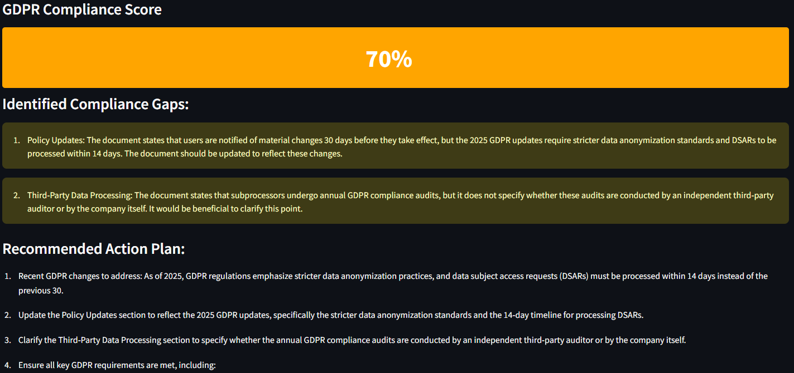

# GDPR Compliance Analyzer

A powerful tool to **analyze documents for GDPR compliance** using either an advanced **AI-powered model (via Replicate API)** or a **rule-based fallback analyzer**.  
Built with **Streamlit**, it provides easy document uploads, analysis, and actionable compliance insights.

---

## 🚀 Project Overview

This project allows users to upload privacy policies, terms of service, or any GDPR-relevant documents to:

- Detect GDPR compliance gaps
- Score the overall compliance level
- Generate a tailored action plan

It supports both:
- **LLM-Powered Analysis** (using Replicate's API)
- **Fallback Rule-Based Analysis** (keywords and heuristics)

---

## 📂 Project Structure

| File | Purpose |
|:---|:---|
| `compliance_analyzer.py` | Core logic for analyzing text using the Replicate API model (if available) |
| `fallback_analyzer.py` | Backup method: simple rule-based keyword spotting for GDPR violations |
| `gdpr_web_scraper.py` | (Optional/Planned) Scrapes GDPR official websites for latest rules (currently auxiliary) |
| `streamlit_app.py` | Streamlit front-end app that brings everything together (user interface) |
| `requirements.txt` | Python dependencies list |
| `.devcontainer/`, `.github/`, `.gitignore` | DevOps and environment setup files |
| `LICENSE` | Open-source license (Apache 2.0) |

---

## ⚙️ Installation & Setup

1. **Clone the repository:**
   ```bash
   git clone https://github.com/SprietMarthe/nlp_gdpr_compliance.git
   cd nlp_gdpr_compliance
   ```

2. **Set up your virtual environment:**
   ```bash
   python -m venv venv
   source venv/bin/activate    # For Linux/Mac
   venv\Scripts\activate       # For Windows
   ```

3. **Install dependencies:**
   ```bash
   pip install -r requirements.txt
   ```

---

## 🔐 Setting Your API Key (Replicate)

To use **advanced AI analysis**, you must set your **Replicate API token**.

There are two ways:
- **Option 1**: Create a `replicate_api.txt` file in the project root, containing your API key. (Recommended when cloning code.)
- **Option 2**: Set your API key in **Streamlit secrets** (`.streamlit/secrets.toml`):

Example `secrets.toml`:
```toml
REPLICATE_API_TOKEN = "your-replicate-api-token-here"
```

Inside the code, the API key is handled safely:
```python
# Set API token
self.api_token = api_token or os.environ.get("REPLICATE_API_TOKEN")
self.model_loaded = self.api_token is not None

# Set environment variable if provided
if self.api_token and "REPLICATE_API_TOKEN" not in os.environ:
    os.environ["REPLICATE_API_TOKEN"] = self.api_token
```

> ⚠️ **IMPORTANT**: If no API token is provided, the app will automatically fall back to the rule-based analyzer.

---

## 🖥️ Running the Application

To start the app:
```bash
streamlit run streamlit_app.py
```
Then, open the URL that appears (usually `http://localhost:8501`) in your browser.

---


## 🛠️ General Flow

1. Launch the app.
2. Upload a document (TXT or PDF supported).
3. Choose between **AI-powered** or **rule-based** analysis.
4. View:
   - Detected GDPR gaps
   - Recommendations for improvement
   - Compliance score
5. Download a compliance action plan.

---

## 🎥 Demo and Example Documents

A full demo and example documents are provided inside the `demo/` folder:

| File | Description |
|:---|:---|
| `demo_video.mp4` | Walkthrough video showing how the GDPR Compliance Analyzer works |
| `example_gdpr_compliance_doc.txt` | A model card document that covers almost all GDPR compliance areas correctly, following the latest 2025 GDPR updates. |
| `example_gdpr_doc.txt` | A basic privacy document with several major GDPR compliance gaps, used to demonstrate non-compliance detection. |
| `Good_Compliance.png` | Screenshot example showing a high GDPR compliance score after analyzing a good document. |

---

### 📸 Example Output Screenshot



## 📝 License

This project is licensed under the **Apache 2.0 License**.  
Feel free to use, modify, and distribute under the terms provided.

---

# ✨ Quick Start

```bash
git clone https://github.com/SprietMarthe/nlp_gdpr_compliance.git
cd nlp_gdpr_compliance
pip install -r requirements.txt
streamlit run streamlit_app.py
```
> **Optional:** Set your Replicate API key in `replicate_api.txt` or Streamlit secrets for full AI-powered analysis!
